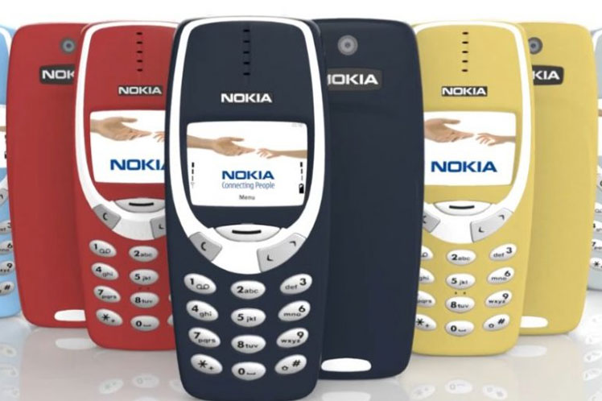

<section id="themes">
	<h2>Themes</h2>
		

			Set your presentation theme:  
			<!-- Hacks to swap themes after the page has loaded. Not flexible and only intended for the reveal.js demo deck. -->
			<a href="#" onclick="document.getElementById('theme').setAttribute('href','css/theme/black.css'); return false;">Black (default)</a> -
			<a href="#" onclick="document.getElementById('theme').setAttribute('href','css/theme/white.css'); return false;">White</a> -
			<a href="#" onclick="document.getElementById('theme').setAttribute('href','css/theme/league.css'); return false;">League</a> -
			<a href="#" onclick="document.getElementById('theme').setAttribute('href','css/theme/sky.css'); return false;">Sky</a> -
			<a href="#" onclick="document.getElementById('theme').setAttribute('href','css/theme/beige.css'); return false;">Beige</a> -
			<a href="#" onclick="document.getElementById('theme').setAttribute('href','css/theme/simple.css'); return false;">Simple</a>  
			<a href="#" onclick="document.getElementById('theme').setAttribute('href','css/theme/serif.css'); return false;">Serif</a> -
			<a href="#" onclick="document.getElementById('theme').setAttribute('href','css/theme/night.css'); return false;">Night</a> -
			<a href="#" onclick="document.getElementById('theme').setAttribute('href','css/theme/moon.css'); return false;">Moon</a> -
			<a href="#" onclick="document.getElementById('theme').setAttribute('href','css/theme/solarized.css'); return false;">Solarized</a>
		

</section>

<link rel="stylesheet" href="css/theme/sky.css" id="theme">

H:

## Primera Presentación ecoFuturo
<!-- .slide: data-background="#73c990" -->
<section data-background-image="Images/flecha.gif " data-background-size="10%" data-background-position="bottom">
by  [Sebastian Chaves](https://github.com/adamantwharf) - [Laura Santos](https://github.com/lsfinite) - [Jimmy Pulido](https://github.com/jiapulidoar) - [Christian Sanabria](Inserte Link aquí :v )
#### Link de la Presentación:
>http://futureun.github.io/EcoFuturoPresentation

H:

# Index
<!-- .slide: data-background="#73c990" -->
<section data-background-image="Images/flecha.gif" data-background-size="10%" data-background-position="bottom">
 1. Presentación del proyecto  <!-- .element: class="fragment" data-fragment-index="1"-->
 1.  Historias de Usuario<!-- .element: class="fragment" data-fragment-index="2"-->
 1.  Casos de Uso  <!-- .element: class="fragment" data-fragment-index="3"-->
 2. Dieño OO <!-- .element: class="fragment" data-fragment-index="4"-->
 2. Patrones de Diseño <!-- .element: class="fragment" data-fragment-index="5"-->
 2. Diagrama UML <!-- .element: class="fragment" data-fragment-index="6"-->

H:

# Presentación del proyecto

¿Qué hago con este celular?<!-- .element: class="fragment" data-fragment-index="1"-->

 </img><!-- .element: class="fragment" data-fragment-index="1"-->

V:

## Brieg Description

 <iframe src="diagrama.pdf" style="width:750px; height:600px;" frameborder="0"></iframe>

H:
#Casos de Uso

V:
<!-- .slide: data-background="#73c990" -->

### Consultar tipos de Residuo
* <b>Descripción:</b>
Sistema de busqueda, información detallada, identificación, consulta y orientación.

* <b>Autores:</b>
ecoUsuario.

  

V:

<!-- .slide: data-background="#73c990" -->

### Crear Usuario
* <b>Descripción:</b>
Sistema de cuentas, creación de ecoUsuarios.

* <b>Autores:</b>
ecoUsuarios, Entidades, etc.

  

V:

### Ver Puntos de Recolección
* <b>Descripción:</b>
Mapa Interactivo, lugares más adecuados, lugares cercanos, Información, contacto, recolección de residuos.

* <b>Autores:</b>
ecoUsuarios, Entidades, Mapa.

  

V:

<!-- .slide: data-background="#73c990" -->

### Publicar/Solicitar Residuos.
* <b>Descripción:</b>
Sistema de publicaciones, oferta y demanda de residuos.

* <b>Autores:</b>
ecoUsuarios, Entidades.

  
