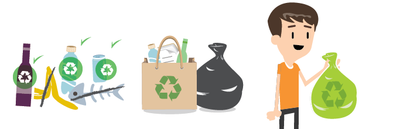

<section id="themes">
	<h2>Themes</h2>
		

			Set your presentation theme:  
			<!-- Hacks to swap themes after the page has loaded. Not flexible and only intended for the reveal.js demo deck. -->
			<a href="#" onclick="document.getElementById('theme').setAttribute('href','css/theme/black.css'); return false;">Black (default)</a> -
			<a href="#" onclick="document.getElementById('theme').setAttribute('href','css/theme/white.css'); return false;">White</a> -
			<a href="#" onclick="document.getElementById('theme').setAttribute('href','css/theme/league.css'); return false;">League</a> -
			<a href="#" onclick="document.getElementById('theme').setAttribute('href','css/theme/sky.css'); return false;">Sky</a> -
			<a href="#" onclick="document.getElementById('theme').setAttribute('href','css/theme/beige.css'); return false;">Beige</a> -
			<a href="#" onclick="document.getElementById('theme').setAttribute('href','css/theme/simple.css'); return false;">Simple</a>  
			<a href="#" onclick="document.getElementById('theme').setAttribute('href','css/theme/serif.css'); return false;">Serif</a> -
			<a href="#" onclick="document.getElementById('theme').setAttribute('href','css/theme/night.css'); return false;">Night</a> -
			<a href="#" onclick="document.getElementById('theme').setAttribute('href','css/theme/moon.css'); return false;">Moon</a> -
			<a href="#" onclick="document.getElementById('theme').setAttribute('href','css/theme/solarized.css'); return false;">Solarized</a>
		

</section>

<!--<link rel="stylesheet" href="css/theme/sky.css" id="theme">
-->
H:

## Presentación Final ecofuturo
<!-- .slide: data-background="#73c990" -->
<section data-background-image="Images/flecha.gif " data-background-size="10%" data-background-position="bottom">
by  [Sebastian Chaves](https://github.com/adamantwharf) - [Laura Santos](https://github.com/lsfinite) - [Jimmy Pulido](https://github.com/jiapulidoar) - [Christian Sanabria](Inserte Link aquí :v )
#### Link de la Presentación:
>http://futureun.github.io/EcoFuturoPresentation

H:

# Index
<!-- .slide: data-background="#73c990" -->
<section data-background-image="Images/flecha.gif" data-background-size="10%" data-background-position="bottom">
 1. Presentación del proyecto  <!-- .element: class="fragment" data-fragment-index="1"-->
 1. Requisitos<!-- .element: class="fragment" data-fragment-index="2"-->
 1.  Casos de Uso  <!-- .element: class="fragment" data-fragment-index="3"-->
 2. Dieño OO <!-- .element: class="fragment" data-fragment-index="4"-->
 2. Patrones de Diseño <!-- .element: class="fragment" data-fragment-index="5"-->

H:

# Presentación del proyecto

V:

<!-- .slide: data-background="/Images/colibri.jpg" -->

<h3>Brief Description</h3>

Plataforma con el fin de promover y enseñar la cultura del reciclaje en Colombia. Reconocer y proteger nuestro espacio.

V:

##Opportunity Alpha

* En Colombia, en general, no existe un buen manejo de los residuos.
* Permite a los mismos usuarios hacer un buen seguimiento de los residuos que generan.

V:

##Stakeholders Alpha  

* Ciudadanía
* UN
* Empresas de reciclaje
* Ministerio de ambiente y desarrollo sostenible

V:

## Team Alpha

H:
#Requisitos

V:
<!-- .slide: data-background="#73c990" -->

### Consultar tipos de Residuo
* <b>Descripción:</b>
Sistema de busqueda, información detallada, identificación, consulta y orientación.

* <b>Autores:</b>
ecoUsuario.

  

V:

<!-- .slide: data-background="#73c990" -->

### Crear Usuario
* <b>Descripción:</b>
Sistema de cuentas, creación de ecoUsuarios.

* <b>Autores:</b>
ecoUsuarios, Entidades, etc.

  

V:

### Ver Puntos de Recolección
* <b>Descripción:</b>
Mapa Interactivo, lugares más adecuados, lugares cercanos, Información, contacto, recolección de residuos.

* <b>Autores:</b>
ecoUsuarios, Entidades, Mapa.

  

V:

<!-- .slide: data-background="#73c990" -->

### Publicar/Solicitar Residuos.
* <b>Descripción:</b>
Sistema de publicaciones, oferta y demanda de residuos.

* <b>Autores:</b>
ecoUsuarios, Entidades.

  

H:
# Casos de Uso

V:
### Diagrama de casos de uso

<!-- .slide: data-background="#73c990" -->

H:
<!-- .slide: data-background-iframe="http://www.taringa.net" -->
# Patrones de interfaz

V:

- Icon Menu 

 
- Search Box 

- Site 

V:

<!-- .slide: data-background-image="/Images/mapas.png" -->

<b>- Mapa Navigator </b>

 Muestra en el mapa los puntos más cercanos.

V:
<!-- .slide: data-background-image="/Images/login.png" -->

<b>- Login </b>

 Combination of an email-address and a password 

H:
## Patrones de Diseño

* Chain  of resposability
* Strategy
* Singleton

H:
## Diagrama de clases

H:

<!-- .slide: data-background="#8904B1" -->

<h1> Web Development </h1>

V:
## MVC Pattern
### Model View Controller
> Es el patrón base utilizado para el desarrollo de la aplicación

(software architectural pattern)

V:
##Don't repeat yourself!
Ruby on Rails
> - Simplicidad para el desarrollo de aplicaciones web
> - Principiantes
> - Realiza mucho del trabajo duro

V:
## Git + GitHub

> Link del Proyecto: https://github.com/FutureUN/EcoFuturo2

V:

## Herramientas

> Atom, Kate

H:
##Prototipo
